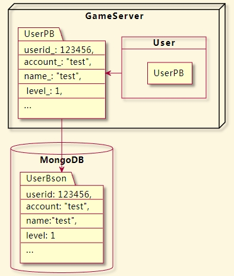

# **PB + MongoDB 增量更新方案**

-- by lihaiming@byedance.com

---
<!-- _class:  -->


# **:file_folder: 目录**

## **01** 设计思路

## **02** 实现细节

## **03** 总结

---

# **01**  设计思路

---
<!-- _class: -->
<!-- _footer: 01. 设计思路 -->

## **大体架构**



- 玩家数据放在 PB 结构中
- 数据库用 MongoDB


---
<!-- _class: -->
<!-- _footer: 01. 设计思路 -->
## **增量更新**


- PB 标记变更字段，导出增量修改
- 增量修改转成 BSON 结构
- 构造 MongoDB 增量更新指令，存储到 MongoDB中

---

# **02**  实现细节

---
<!-- _class: -->
<!-- _footer: 02. 实现细节 -->
## **如何导出增量修改:question:**

- **增加 dirty_bits 标记位**
- **修改各字段时更新 dirty_bits 标记位**
- **根据 dirty_bits 导出增量结构**


---
<!-- _class: -->
<!-- _footer: 02. 实现细节 -->
### **增加 dirty_bits 标记位**

```protobuf
message UserPB {
    option (has_dirty_bits) = true;
    fixed64 userid = 1;
    bytes account = 2;
    ...
}
```

```protobuf
message UserPB {
    fixed64 userid = 1;
    bytes account = 2;
    ...
    dirty_bits_ = 51234;
}
```

---
<!-- _class: -->
<!-- _footer: 02. 实现细节 -->
<!-- 标记 dirty_bits 之前需要确保 dirty_bits 数组有分配足够空间。  mutable 返回也需要做标记，不管外部调用者有没有修改 -->

### **修改各字段时更新 dirty_bits 标记位**

```c++
inline void Cat::clear_status() {
  while (_dirty_bits_size() < 0 + 1) _internal_add__dirty_bits(0);
  _dirty_bits_[0] |= 0x1;
  status_ = 0;
}
inline void Cat::set_status(::Msg::EStatusType value) {
  while (_dirty_bits_size() < 0 + 1) _internal_add__dirty_bits(0);
  _dirty_bits_[0] |= 0x1;
  status_ = value;
}
inline ::Msg::Leg* Cat::mutable_leg(int index) {
  while (_dirty_bits_size() < 0 + 1) _internal_add__dirty_bits(0);
  _dirty_bits_[0] |= 0x8;
  return leg_.Mutable(index);
}
```

---
<!-- _class: -->
<!-- _footer: 02. 实现细节 -->
### **根据 dirty_bits 导出增量结构**

```c++
void Cat::ExportDirtyObj(Cat &out) const {
  if (this->is_status_dirty()) {
    out.set_status(this->status());
  }
  if (this->is_name_dirty()) {
    *out.mutable_name() = this->name();
  }
  if (this->is_leg_dirty()) {
    *out.mutable_leg() = this->leg();
  }
  ...
}
```

---
<!-- _class: -->
<!-- _footer: 02. 实现细节 -->
## **增量结构如何存储:question:**


- **采用 PB 反射机制来转换字段**
- **根据 dirty_bits 字段来设置字段**

---

<!-- _class: -->
<!-- _footer: 02. 实现细节 -->

### **采用 PB 反射机制来转换字段**

```c++
    switch (pField->cpp_type()) {
#define CASE_FIELD_TYPE(cpptype, pbfunc, valuetype, bsonfunc) \
    case google::protobuf::FieldDescriptor::CPPTYPE_##cpptype: { \
        valuetype value = pReflection->Get##pbfunc(xInMsg, pField); \
        bson_append_##bsonfunc(&xOutBson, pField->name().c_str(), pField->name().length(), value); \
        break; \
    }
    ...
    CASE_FIELD_TYPE(BOOL,   Bool,       bool,       bool);
    CASE_FIELD_TYPE(INT32,  Int32,      int32_t,    int32);
    CASE_FIELD_TYPE(UINT32, UInt32,     uint32_t,   int32);
    ...
```

---
<!-- _class: -->
<!-- _footer: 02. 实现细节 -->
### **根据 dirty_bits 字段来设置字段**

```c++
const FieldDescriptor* pDirtyField = pDescriptor->FindFieldByName(DIRTY_BITS_FIELD_NAME);
for (int i = 0; i < pDescriptor->field_count(); ++i) {
    const FieldDescriptor* pField = pDescriptor->field(i);
    if (!pField)
    {
        continue;
    }
    if (nullptr != pDirtyField)
    {
        uint32_t nDirtyIndex = pField->index() / 32;
        uint32_t nDirtFlag = pReflection->GetRepeatedUInt32(xInMsg, pDirtyField, nDirtyIndex);
        if ((nDirtFlag & (0x1 << (pField->index() % 32))) == 0) {
            continue;
        }
    }
    ...
}
```

---

# **03**  总结

---
<!-- _class: -->
<!-- _footer: 03. 总结 -->

## **工具工作流程介绍**


- 解析 .proto 中的 has_dirty_bits 选项生成 dirty_bits 字段
- 调用 protoc 生成源文件
- 对源文件进行修改

---
<!-- _class: -->
<!-- _footer: 03. 总结 -->
## **经验总结**

**1. BSON 中增加 map 标记**
**2. 判断嵌套层次，不同的嵌套需要不同的处理**

---

# **THANKS:exclamation:**
