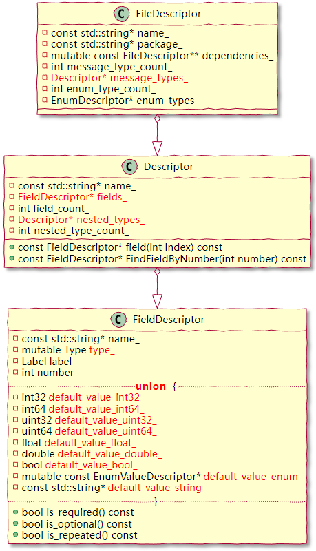

# **ProtoBuf反射原理探究**

-- by lihaiming

---
<!-- _class:  -->


# **:file_folder: 目录**

## **01** 反射概述

## **02** 其他反射方案

## **03** PB 如何实现反射

## **04** 反射信息如何构建

---
<!-- _class: lead -->

# **01**  反射概述

---
<!-- _class: -->
<!-- _footer: 01. 反射概述 -->

## **反射是什么:question:**

> 反射是指计算机程序在运行时（runtime）可以访问、检测和修改它本身状态或行为的一种能力。用比喻来说，反射就是程序在运行的时候能够“观察”并且修改自己的行为。
—— 引自 wiki

---
<!-- _class: -->
<!-- _footer: 01. 反射概述 -->
<!-- ShortDebugString 函数大家都知道，这是打印 PB 所有字段和值的函数，它也是用 PB 反射机制来实现的-->
## **反射能做什么:question:**

```c++
int main()
{
    Cmd::ProtoBufValue pb;
    std::cout << pb.ShortDebugString() << std::endl;
    return 0;
}
```

写出更灵活更强大的代码

---
<!-- _class: lead -->
<!--_paginate: false -->
<!-- 在介绍 PB 反射之前，我想先来看看其他的语言是如何实现的反射机制，以此来更深入的理解反射的根本原理 -->

# **02**  其他反射方案

---
<!-- _class: -->
<!-- _footer: 02. 其他反射方案 -->
<!-- Java 的反射机制依赖于编译时生成的 .class 字节码文件，该文件中记录了类的各种类型信息，然后通过加载到内存生成一个唯一的 Class 对象，因此，对应的类对象可以通过该 Class 对象获取到类的方法、属性以及构造函数等。-->
## **Java**


---
<!-- _class: -->
<!-- _footer: 02. 其他反射方案 -->
<!--在 Go 之中，所有结构都被认为是实现了空接口interface{}，因此每一个结构体都可以被转换成如下emptyInterface结构，通过其中的 rtype 结构体，则可以获取对应类型的一切信息。这个是 golang 在语言层面对类的信息进行了额外的记录。-->
## **Golang**

```golang
type emptyInterface struct {
    typ  *rtype
    word unsafe.Pointer
}
```

---
<!-- _class: -->
<!-- _footer: 02. 其他反射方案 -->
<!-- RTTR（Runtime type information）库是 C++ 版本的反射库。这个反射库的代码量相对较大，逻辑较为复杂，但是其逻辑也可以简单的理解为，需要手动将类的名字、属性、方法等手动注册到一个单例对象（type_register_private）之中进行管理，调用的时候则从单例对象之中获取相应的信息，以访问对应的属性或者方法。-->
## **C++ RTTR**

```c++
#include <rttr/registration>
using namespace rttr;
struct MyStruct { 
    MyStruct() {};
    void func(double) {};
    int data; 
};
RTTR_REGISTRATION {
    registration::class_<MyStruct>("MyStruct")
         .constructor<>()
         .property("data", &MyStruct::data)
         .method("func", &MyStruct::func);
}
```

---
<!-- _class: -->
<!-- _footer: 02. 其他反射方案 -->
<!-- RTTR（Runtime type information）库是 C++ 版本的反射库。这个反射库的代码量相对较大，逻辑较为复杂，但是其逻辑也可以简单的理解为，需要手动将类的名字、属性、方法等手动注册到一个单例对象（type_register_private）之中进行管理，调用的时候则从单例对象之中获取相应的信息，以访问对应的属性或者方法。-->

```c++
// Constructing types
type t = type::get_by_name("MyStruct");
variant var = t.create();    // will invoke the previously registered ctor

constructor ctor = t.get_constructor();  // 2nd way with the constructor class
var = ctor.invoke();

//Invoke Methods
MyStruct obj;

method meth = type::get(obj).get_method("func");
meth.invoke(obj, 42.0);

// 这里获取 obj 没有用名字，主要采用了模板类型推导
// 并且加上诸如 __PRETTY_FUNCTION__ 的编译器宏，两者结合来获取类型名
variant var = type::get(obj).create();
meth.invoke(var, 42.0);
```

---
<!-- _class: -->
<!-- _footer: 02. 其他反射方案 -->
<!-- 通过上面的对几种反射方案的总结，不难看出：反射机制的实现，需要如下两个基础 -->
## **小结**

反射实现条件：
**1.** 需要额外存储类的结构信息，也就是类的**描述信息**。
**2.** 类的描述信息可以**映射**到实际实例的属性和方法上。。

简单类比：
**1.** 有个地图（**描述信息**）
**2.** 知道当前位置在地图上的位置，以及方向（**映射关系**）

---
<!-- _class: lead -->
<!-- 我们已经对如何建立反射机制有了足够深入的了解了，接下来我们开始详细讲述一下 PB 是如何实现反射的 -->
# **03**  PB 如何实现反射

---
<!-- _class: -->
<!-- _footer: 03. PB 如何实现反射 -->
<!-- PB 的反射机制主要靠以下两个结构来实现，它在每个 PB 结构之中都自动生成了如下的几个函数，用以获取这两个结构，接下来 -->
## **两个关键结构**

```c++
static const ::PROTOBUF_NAMESPACE_ID::Descriptor* GetDescriptor() {
    return GetMetadataStatic().descriptor;
}
static const ::PROTOBUF_NAMESPACE_ID::Reflection* GetReflection() {
    return GetMetadataStatic().reflection;
}
static ::PROTOBUF_NAMESPACE_ID::Metadata GetMetadataStatic() {
    ::PROTOBUF_NAMESPACE_ID::internal::AssignDescriptors(&::descriptor_table_test_2eproto);
    return ::descriptor_table_test_2eproto.file_level_metadata[kIndexInFileMessages];
}
```

---
<!-- _class: -->
<!-- _footer: 03. PB 如何实现反射 -->
<!-- 通过上面的对几种反射方案的总结，不难看出：反射机制的实现，需要如下两个基础 -->


