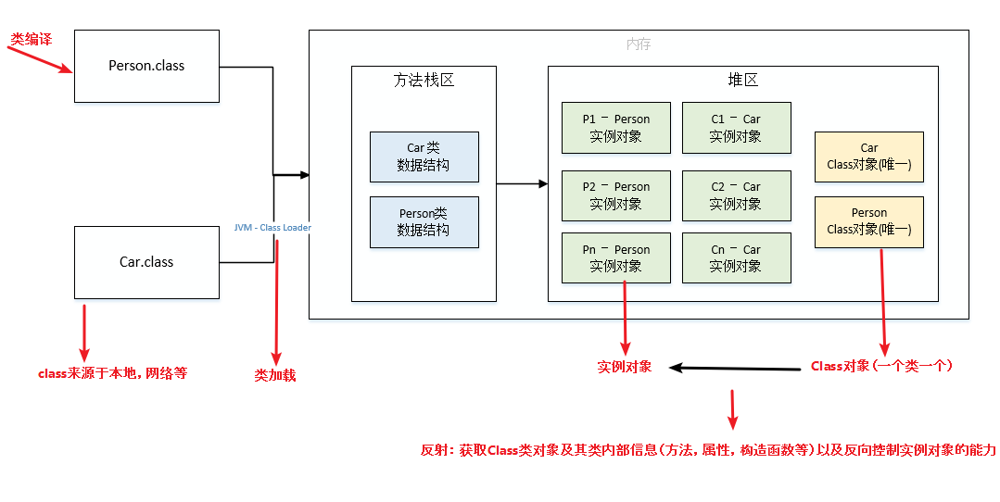
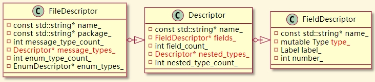
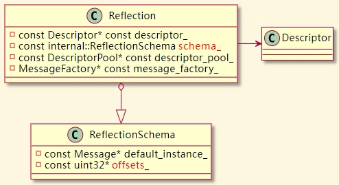
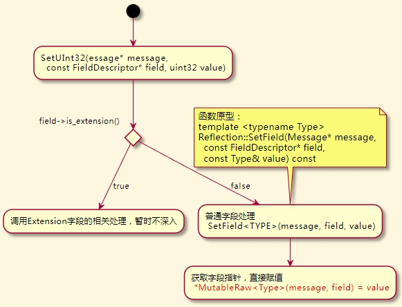

# **ProtoBuf反射原理探究**

-- by lihaiming@byedance.com

---
<!-- _class:  -->


# **:file_folder: 目录**

## **01** 反射概述

## **02** 其他反射方案

## **03** PB 如何实现反射

## **04** 反射信息如何构建

---
<!-- _class: lead -->

# **01**  反射概述

---
<!-- _class: -->
<!-- _footer: 01. 反射概述 -->

## **反射是什么:question:**

> 反射是指计算机程序在运行时（runtime）可以访问、检测和修改它本身状态或行为的一种能力。用比喻来说，反射就是程序在运行的时候能够“观察”并且修改自己的行为。
—— 引自 wiki

---
<!-- _class: -->
<!-- _footer: 01. 反射概述 -->
<!-- ShortDebugString 函数大家都知道，这是打印 PB 所有字段和值的函数，它也是用 PB 反射机制来实现的-->
## **反射能做什么:question:**

```c++
int main()
{
    Cmd::ProtoBufValue pb;
    std::cout << pb.ShortDebugString() << std::endl;
    return 0;
}
```

写出更灵活更强大的代码

---
<!-- _class: lead -->
<!--_paginate: false -->
<!-- 在介绍 PB 反射之前，我想先来看看其他的语言是如何实现的反射机制，以此来更深入的理解反射的根本原理 -->

# **02**  其他反射方案

---
<!-- _class: -->
<!-- _footer: 02. 其他反射方案 -->
<!-- Java 的反射机制依赖于编译时生成的 .class 字节码文件，该文件中记录了类的各种类型信息，然后通过加载到内存生成一个唯一的 Class 对象，因此，对应的类对象可以通过该 Class 对象获取到类的方法、属性以及构造函数等。-->
## **Java**



---
<!-- _class: -->
<!-- _footer: 02. 其他反射方案 -->
<!--在 Go 之中，所有结构都被认为是实现了空接口interface{}，因此每一个结构体都可以被转换成如下emptyInterface结构，通过其中的 rtype 结构体，则可以获取对应类型的一切信息。这个是 golang 在语言层面对类的信息进行了额外的记录。-->
## **Golang**

```golang
type emptyInterface struct {
    typ  *rtype
    word unsafe.Pointer
}
```

---
<!-- _class: -->
<!-- _footer: 02. 其他反射方案 -->
<!-- RTTR（Runtime type information）库是 C++ 版本的反射库。这个反射库的代码量相对较大，逻辑较为复杂，但是其逻辑也可以简单的理解为，需要手动将类的名字、属性、方法等手动注册到一个单例对象（type_register_private）之中进行管理，调用的时候则从单例对象之中获取相应的信息，以访问对应的属性或者方法。-->
## **C++ RTTR**

```c++
#include <rttr/registration>
using namespace rttr;
struct MyStruct { 
    MyStruct() {};
    void func(double) {};
    int data; 
};
RTTR_REGISTRATION {
    registration::class_<MyStruct>("MyStruct")
         .constructor<>()
         .property("data", &MyStruct::data)
         .method("func", &MyStruct::func);
}
```

---
<!-- _class: -->
<!-- _footer: 02. 其他反射方案 -->
<!-- RTTR（Runtime type information）库是 C++ 版本的反射库。这个反射库的代码量相对较大，逻辑较为复杂，但是其逻辑也可以简单的理解为，需要手动将类的名字、属性、方法等手动注册到一个单例对象（type_register_private）之中进行管理，调用的时候则从单例对象之中获取相应的信息，以访问对应的属性或者方法。-->

```c++
// Constructing types
type t = type::get_by_name("MyStruct");
variant var = t.create();    // will invoke the previously registered ctor

constructor ctor = t.get_constructor();  // 2nd way with the constructor class
var = ctor.invoke();

//Invoke Methods
MyStruct obj;

method meth = type::get(obj).get_method("func");
meth.invoke(obj, 42.0);

// 这里获取 obj 没有用名字，主要采用了模板类型推导
// 并且加上诸如 __PRETTY_FUNCTION__ 的编译器宏，两者结合来获取类型名
variant var = type::get(obj).create();
meth.invoke(var, 42.0);
```

---
<!-- _class: -->
<!-- _footer: 02. 其他反射方案 -->
<!-- 通过上面的对几种反射方案的总结，不难看出：反射机制的实现，需要如下两个基础 -->
## **小结**

反射实现条件：
**1.** 需要额外存储类的结构信息，也就是类的**描述信息**。
**2.** 类的描述信息可以**映射**到实际实例的属性和方法上。。

简单类比：
**1.** 有个地图（**描述信息**）
**2.** 知道当前位置在地图上的位置，以及方向（**映射关系**）

---
<!-- _class: lead -->
<!-- 我们已经对如何建立反射机制有了足够深入的了解了，接下来我们开始详细讲述一下 PB 是如何实现反射的 -->
# **03**  PB 如何实现反射

---
<!-- _class: -->
<!-- _footer: 03. PB 如何实现反射 -->
<!-- PB 的反射机制主要靠以下两个结构来实现，它在每个 PB 结构之中都自动生成了如下的几个函数，用以获取这两个结构，接下来 -->
## **两个关键结构**

```c++
static const ::PROTOBUF_NAMESPACE_ID::Descriptor* GetDescriptor() {
    return GetMetadataStatic().descriptor;
}
static const ::PROTOBUF_NAMESPACE_ID::Reflection* GetReflection() {
    return GetMetadataStatic().reflection;
}
static ::PROTOBUF_NAMESPACE_ID::Metadata GetMetadataStatic() {
    ::PROTOBUF_NAMESPACE_ID::internal::AssignDescriptors(&::descriptor_table_test_2eproto);
    return ::descriptor_table_test_2eproto.file_level_metadata[kIndexInFileMessages];
}
```

---
<!-- _class: -->
<!-- _footer: 03. PB 如何实现反射 -->
<!--
- FieldDescriptor 是对 PB 结构中字段的描述，记录了字段的名字、类型、序号、以及一个由整型、枚举、浮点型、布尔值以及字符串组成的联合体来表示各种简单类型字段的默认值（复杂结构如引用的 PB 结构没有默认值，但引用的 PB 结构本身的简单字段有默认值）。成员Type type_表示该字段的类型，包括各类简单类型以及 PB 结构（也就是 TYPE_MESSAGE）等。Type 枚举的定义如下所示。
- Descriptor 是对 PB 结构的描述，其中包含了一个 FieldDescriptor 组成的数组FieldDescriptor* fields_，同时也用Descriptor* nested_types_数组来代表 PB 结构内部定义的 PB 结构，类似 C++ 中内部类的概念。一个 PB 结构中任意类型的字段，都可以使用 FieldDescriptor 来表示。
- FileDescriptor 则是对整个 .proto 文件的描述，其内包含了描述一个 .proto 文件所需要的所有元素，比如：名字、包、依赖的其他 .proto 文件、PB 结构（Descriptor）、枚举（EnumDescriptor）等等。
通过 Descriptor 我们可以获取到所有字段的字段描述符 FieldDescriptor 并获知每个字段的类型、名字、标签等等信息，这也是反射机制能实现的一个重要基础。
 -->

### **Descriptor**



- **FileDescriptor**: 文件描述符。
- **Descriptor**: PB 结构描述符。
- **FieldDescriptor**: 字段描述符。

---
<!-- _class: -->
<!-- _footer: 03. PB 如何实现反射 -->
<!--
通过 Descriptor 可以获知到类的结构，但是 Descriptor 只是所有 PB 类共有的一个描述符，而且这个信息，并不涉及类的内存排布，每个字段和类中各成员的对应关系是无法获知的。因此无法仅通过 Descriptor 结构直接操作实例中的成员。这时就需要将描述性的 Descriptor 结构与具体实例建设映射关系——建立结构信息与具体实例的映射，能通过结构信息直接操作对象实例的具体成员。
这个机制，就是通过 Reflection 结构来实现的。先来看看 Reflection 的结构。
- descriptor_：指向类对应描述信息。
- schema_：ReflectionSchema 结构，这是将描述信息映射到具体实例的关键性结构。其中存储了对应 PB 结构的默认实例的指针，以及各成员的内存偏移数组 offsets_。-->

### **Reflection**



- **schema_**: 存储映射关系。
  - **offset_**: 存储字段地址偏移。

---
<!-- _class: -->
<!-- _footer: 03. PB 如何实现反射 -->
<!-- 接下来我们通过一个具体例子来看看 PB 是如何通过 Reflection 以及 Descriptor 来操作一个具体实例的。例子也很简单，就是修改一个 PB 结构的age 字段, 首先要根据字段名查找字段描述符，然后通过 Reflection 类型对字段描述符进行操作。-->

## **反射操作实例**

```c++
void ChangeAge(const Message& msg, unsigned int newAge) {
    const Descriptor* pDescriptor = msg.GetDescriptor();
    const Reflection* pReflection = msg.GetReflection();
    const FieldDescriptor* pAgeField = pDescriptor->FindFieldByName("age");
    if (nullptr != pAgeField) {
        return;
    }
    pReflection->SetUInt32(&msg, pAgeField, newAge);
}
int main() {
    Cat c; // cat 是一个PB结构
    c.set_age(1);
    ChangeAge(c, c.age() + 1); // 年龄增大一岁
}
```

---
<!-- _class: -->
<!-- _footer: 03. PB 如何实现反射 -->
<!-- 接下来我们就看看 Reflection 是如何修改了 PB 结构的成员的。具体的实现在SetUInt32()函数 之中，其调用过程如下, 可以看到，最终是通过 MutableRaw 函数，直接取到了字段对应的地址，然后给它赋值。-->

### **调用过程**



---
<!-- _class: -->
<!-- _footer: 03. PB 如何实现反射 -->
<!-- 所以核心就在于如何能给直接获取到字段的地址，下面我们结合代码分析一下. 首先这里调用了GetPointerAtOffset()函数，这里的目的就是通过地址偏移，获取 message 对象的成员地址。那么成员地址的偏移，就是通过 schema_ 来计算的 -->
### **源码分析 -- MutableRaw**

```c++
//generated_message_reflection.cc
template <typename Type>
Type* Reflection::MutableRaw(Message* message,
                             const FieldDescriptor* field) const {
  return GetPointerAtOffset<Type>(message, schema_.GetFieldOffset(field));
｝

template <class To>
To* GetPointerAtOffset(Message* message, uint32 offset) {
  return reinterpret_cast<To*>(reinterpret_cast<char*>(message) + offset);
}
```

---
<!-- _class: -->
<!-- _footer: 03. PB 如何实现反射 -->
<!-- 追踪GetFieldOffset()函数的调用过程我们可以看到这里是使用 FieldDescriptor 的 index 成员作为下标，来获取 offsets_ 数组中的元素，也就是说：offsets_ 数组中存储了 Message 结构中个成员的地址相对偏移量。

另外有个小细节：OffsetValue()函数针对两种字符串类型 TYPE_STRING 和 TYPE_BYTES 做了特殊处理，返回的地址偏移时，将最低位置空了，这是因为由于字节对齐的关系，字符串类型的成员地址偏移通常是 8 的整数倍（64位操作系统下），也就是意味着字符串成员的地址偏移的最低三位是 0，因此这里利用了这个性质，将最低一位用来存储 inlined 标记，这个 inlined 标记用来表示字符串成员使用的字符串类型是 ArenaStringPtr 类型还是 InlinedStringField 类型。具体两种字符串结构的区别这里就不过多深入了。
 -->

```c++
struct ReflectionSchema {
  uint32 GetFieldOffset(const FieldDescriptor* field) const {
    return GetFieldOffsetNonOneof(field);
  }
  uint32 GetFieldOffsetNonOneof(const FieldDescriptor* field) const {
    GOOGLE_DCHECK(!field->containing_oneof());
    return OffsetValue(offsets_[field->index()], field->type());
  }
  static uint32 OffsetValue(uint32 v, FieldDescriptor::Type type) {
    if (type == FieldDescriptor::TYPE_STRING ||
        type == FieldDescriptor::TYPE_BYTES) {
      return v & ~1u;
    } else {
      return v;
    }
  }
}
```

---
<!-- _class: -->
<!-- _footer: 03. PB 如何实现反射 -->
## **小结**
- **Descriptor**：**描述**类的字段、方法等
- **Reflection**：将通过地址偏移，将描述符与类的实例进行**映射**